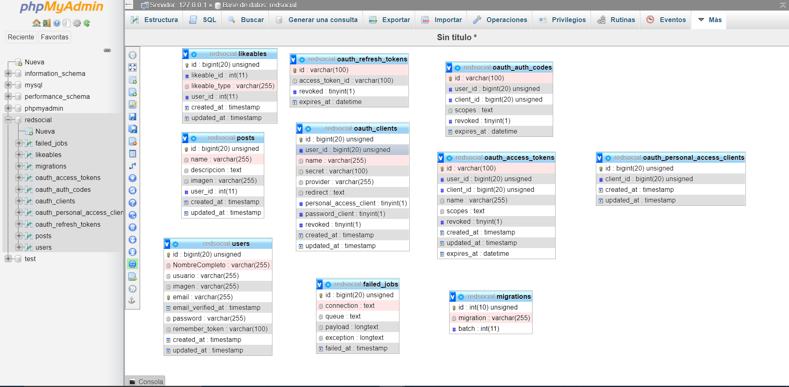
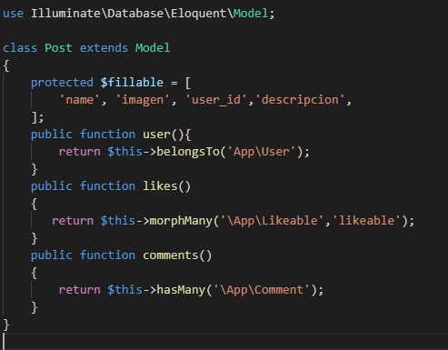
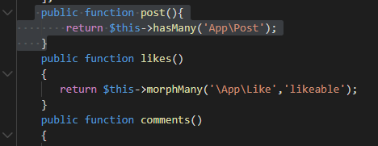
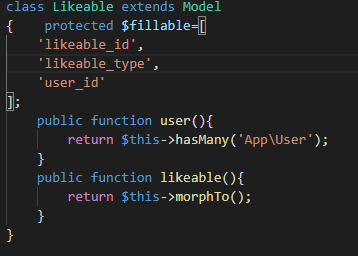
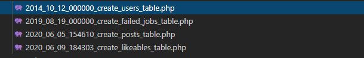
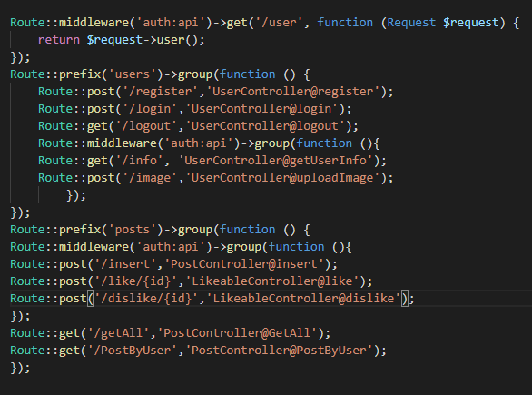

# PROYECTO-RED-SOCIAL-BACKEND
## COOLMEET
### Este es mi backend de mi  Red-social , acontinuación hare unas breves explicaciones de como funciona, los resquisitos, las tecnologias que hemos utilizamo y demas, espero que os guste, graciass._

## Pre-requisitos 📋

_¿Que cosas necesitas para instalar el software y como instalarlas?_

Necesitaremos una herramienta donde podremos trabajar , en el cual yo he utilizado Visual Studio Code, en el back he utilizado php-laravel , tambien tenemos que tener instalado xampp para la base de datos, tambien el composer ya que utlizamos el artisan ,  El proyecto es compatible para todas los sistemas operativos, y para todas las plataformas de internet.

## Instalación 🔧


_Empezamos con la instalación_

_El primer paso al descargar el repositorio, tenemos que hacer el comando de abajo para poder descargar todos los modulos que hemos utilizado y asi poder hacer funcionar el proyecto, importante entrar en la carpeta de backend y realizar el comando_

  

```
composer update
```

  

_Y para arrancar el backend, lo haremos con el siguiente comando, lo mismo que antes situarnos en cada carpeta y ejecutar el siguiente comando_

```
php artisan serve
```
_Y ahora os voy a mostrar como funciona el backend de la red social_

  

## TABLAS 

 _Estas son las tablas que tenemos que tener, las tablas que hemos generado con artisan son las de users, likeables, posts, las otras tablas se generan con el passport el cual nos hace el token del usuario y la autenticacion y nos la encripta(las relaciones no las muestra en el phpadmin pero las tenemos en cada modelo de la tabla)_
 ## RELACIONES
 ### Relaciones de la tabla de post
<br>
 ### Relaciones de la tabla de user 
 <br>
  ### Relaciones de la tabla de likeables
<br>
_Aqui tenemos todas las migraciones de las tablas_
## MIGRACIONES

_Aqui tenemos todas las migraciones de las tablas_
## RUTAS

y aqui podemos ver las rutas que hemos del posts y de los usuarios 

## Construido con 🛠️

_En este proyecto hemos utilizado las siguientes tecnologias :_

  

*  PHP  
*  LARAVEL
*  COMPOSER
*  MYSQL


  

## Autores ✒️

  


*  **Antony** - *Todo el proyecto* -(https://github.com/antony0110)


---

⌨️ con ❤️ por [Antony](https://github.com/antony0110)
